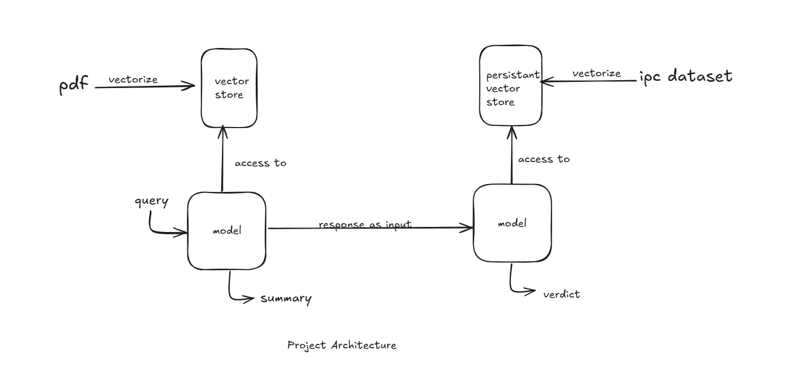

Explanation of Above Achitecture-

A Qdrant Vector Database is utilized to store vector embeddings generated from a PDF uploaded by the user. When a PDF is uploaded, it is processed, and its vector embeddings are saved in the Qdrant database.
A model is then chosen, which has access to this vector store. This model uses the stored vector embeddings to provide a summary of the PDF and answer related questions based on the content.
Additionally, a separate persistent database is maintained, which contains embeddings derived from the IPC (Indian Penal Code) dataset. The IPC dataset includes various criminal sections and the corresponding punishments outlined under those sections.
The workflow involves providing the PDF summary (generated earlier) as input to another model, which then attempts to predict the outcome of a legal case or query based on the IPC embeddings.

Important Considerations:
The model should not have an excessively high number of parameters to minimize the risk of hallucination (generating incorrect or unsupported conclusions).
Hallucination is particularly problematic when no information about a specific crime is available, as it may lead to erroneous or unreliable predictions.
For this reason, models such as mini version of Llama and Mistral, which are efficient and reliable, are used for the tasks.
